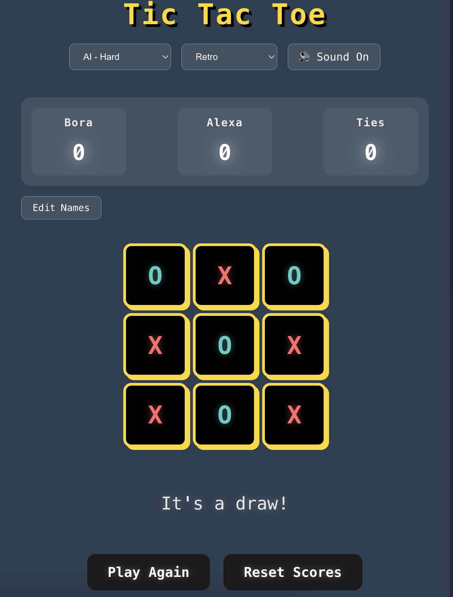

# Modern Tic Tac Toe

A beautifully designed, feature-rich implementation of the classic Tic Tac Toe game built with React and TypeScript. This project showcases modern web development practices, engaging UI/UX design, and intelligent gameplay features.



## ✨ Features

### 🎮 Game Modes
- Player vs Player
- Player vs AI with multiple difficulty levels:
  - Easy: Random moves
  - Medium: Smart moves with 70% accuracy
  - Hard: Unbeatable AI using minimax algorithm

### 🎨 Visual Design
- Multiple theme options:
  - Default: Modern minimalist
  - Neon: Vibrant cyberpunk style
  - Retro: Classic arcade feel
  - Cosmic: Space-inspired design
- Smooth animations and transitions
- Responsive layout for all devices
- Victory celebrations with confetti
- Dynamic color gradients

### 🎵 Audio & Visual Feedback
- Move sound effects
- Victory/Draw sound effects
- Sound toggle option
- Visual feedback for moves
- Winning line animations

### 📊 Game Features
- Player name customization
- Score tracking
- Game history
- Persistent storage for player names and scores
- Real-time game status updates

### 💫 Animations
- Winning line highlight
- Score change animations
- Confetti on victory
- Button hover effects
- Smooth transitions

## 🛠️ Technologies Used

- React 18
- TypeScript
- Vite
- CSS3 with modern features:
  - Flexbox/Grid
  - CSS Variables
  - Animations
  - Gradients
  - Glass morphism effects
- Local Storage for data persistence
- Responsive Design
- Modern JavaScript features

## 🚀 Getting Started

1. Clone the repository:
   ```bash
   git clone https://github.com/yourusername/tic-tac-toe.git
   ```

2. Install dependencies:
   ```bash
   cd tic-tac-toe
   npm install
   ```

3. Run the development server:
   ```bash
   npm run dev
   ```

4. Open [http://localhost:5173](http://localhost:5173) in your browser

## 🎯 Project Structure

```
src/
├── components/
│   ├── Board.tsx     # Game board component
│   ├── Confetti.tsx  # Victory celebration effects
│   └── Game.tsx      # Main game logic
├── styles/
│   └── App.css       # Global styles and themes
├── App.tsx           # Root component
└── main.tsx         # Entry point
```

## 🎨 Features Showcase

### Themes
- Default: Clean, modern interface with subtle gradients
- Neon: Vibrant colors with glow effects
- Retro: Pixelated style with classic game feel
- Cosmic: Space-themed with stellar effects

### AI Difficulty Levels
- Easy: Perfect for beginners
- Medium: Balanced challenge
- Hard: Implements minimax algorithm for unbeatable gameplay

### Responsive Design
- Mobile-first approach
- Landscape mode optimization
- Tablet and desktop layouts
- Touch-friendly controls

## 🤝 Contributing

Contributions are welcome! Please feel free to submit a Pull Request.

## 📝 License

This project is licensed under the MIT License - see the [LICENSE](LICENSE) file for details.

## 🙋‍♂️ Author

Your Name
- GitHub: [@bugracinbat](https://github.com/bugracinbat)

## 🌟 Acknowledgments

- Inspired by classic arcade games
- Modern UI/UX principles
- React community best practices
